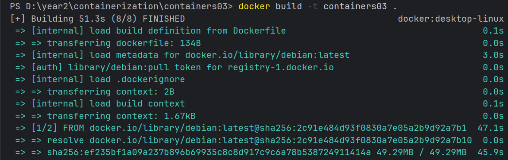
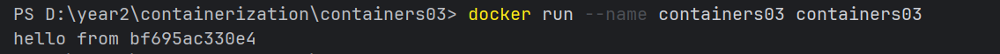
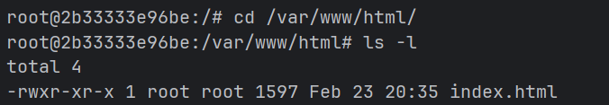

## Отчет по лабораторной работе №3: Первый контейнер 

### Цель работы
Данная лабораторная работа знакомит с основами контейнеризации и подготавливает рабочее место для выполнения следующих лабораторных работ.

### Задание
Установить Docker Desktop и проверить его работоспособность.

### Выполнение
Для выполнения лабораторной работы необходим `Docker Desktop`, который у меня уже был установлен и настроен.

Создаем репозиторий и клонируем на компьютер. Создаем папки `images`, `site` и файлы `Dockerfile`, `README.md` и `index` в папке `site`.

Включаем в файл `Dockerfile` следующее содержимое:

```
FROM debian:latest
COPY ./site/ /var/www/html/
CMD ["sh", "-c", "echo hello from $HOSTNAME"]
```

- Команда `FROM` указывает базовый образ, на основе которого будет создан наш новый образ. Созданный образ в данном случае будет включать в себя минимальный набор файлов, необходимых для работы операционной системы Debian. 
- Команда `COPY` копирует файлы и директории из контекста сборки в файловую систему образа. В нашем случае `./site/` это путь к файлу в контексте сборки и `/var/www/html/` путь к файлу в файловой системе образа.
- Команда `CMD` задает команды, которые будут выполнены при запуске контейнера. В данном случае команды выполнятся в виде массива. Вызовется командная оболочка и выполнится команда с выводом переданного текста с переменной окружения `$HOSTNAME`.

Открываем терминал в папке containers03 и выполняем команду:

```
docker build -t containers03 .
```
При вызове команды `docker build`, Docker создаст образ на основе Dockerfile и контекста сборки с именем `containers03`.

**Сколько времени создавался образ?**



Данный образ создавался 51.3 секунды.

Выполняем команду для запуска контейнера:

```
docker run --name containers03 containers03
```
**Что было выведено в консоли?**



В консоли была выведена фраза которую мы указали в команде `CMD` с именем нашего хоста.

Удаляем и запускаем контейнер снова:

```
docker rm containers03
docker run -ti --name containers03 containers03 bash
```

Выполняем следующие команды:

```
cd /var/www/html/
ls -l
```

**Что выводится на экране?**



На экране выводится содержимое папки `html`. В нашем случае мы увидим информацию про файл `index.html`, который был создан ранее.

### Вывод

В ходе выполнения лабораторной работы были изучены основы контейнеризации. Был создан Dockerfile на основе образа Debian, выполнена сборка собственного Docker-образа и запуск контейнера на его основе. Также было проверено копирование файлов в файловую систему контейнера и выполнение команд при его запуске. 

В результате были получены практические навыки создания образов, запуска контейнеров и работы с их файловой системой, что подтверждает готовность среды к дальнейшему выполнению лабораторных работ.

### Источники 

- https://elearning.usm.md/mod/lesson/view.php?id=282117&pageid=2999
- https://habr.com/ru/articles/804325/
- https://docs.docker.com/reference/cli/docker/ 
